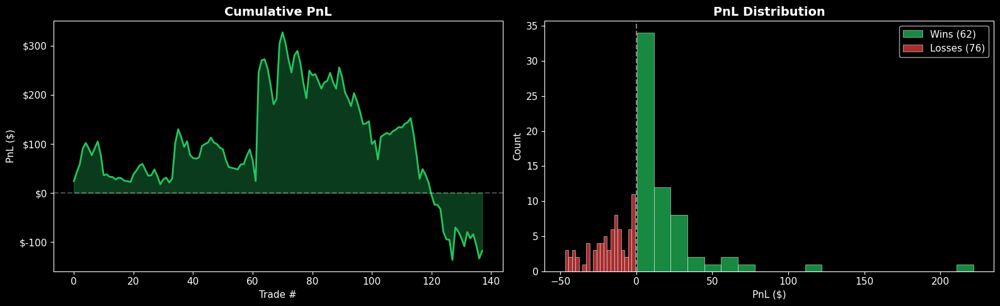
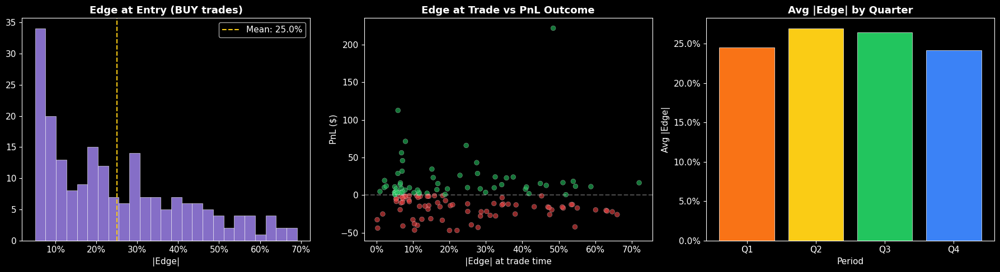
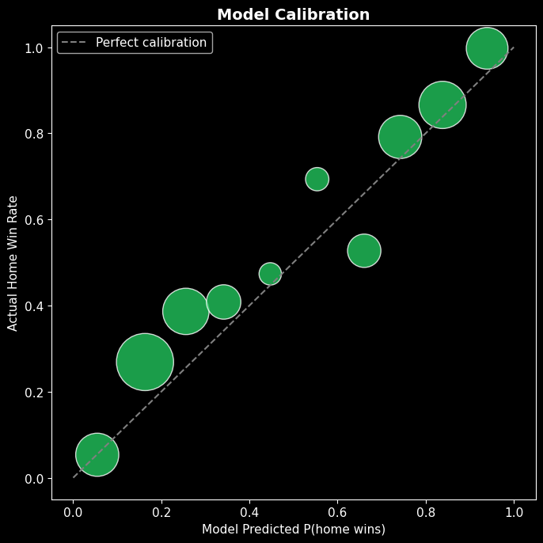
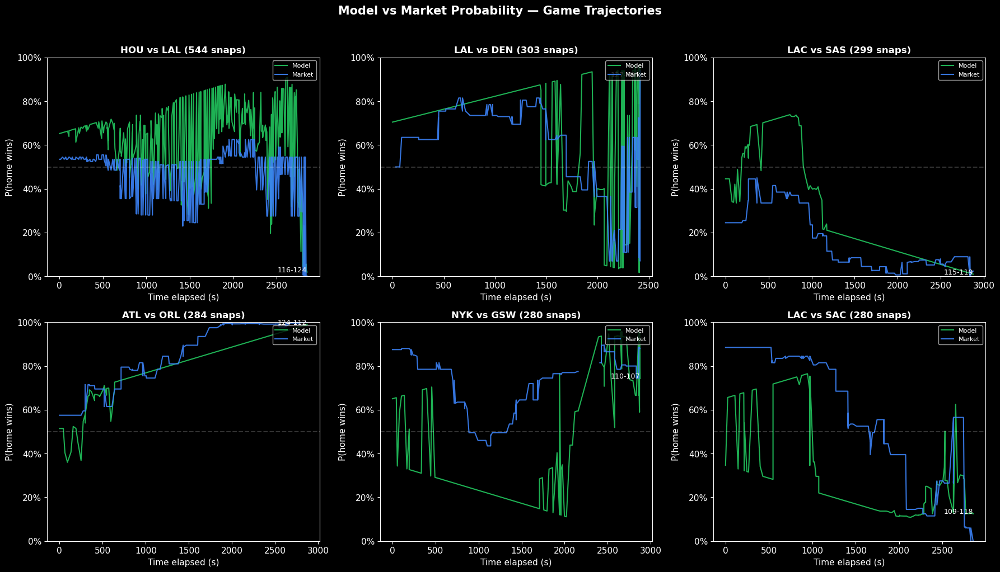
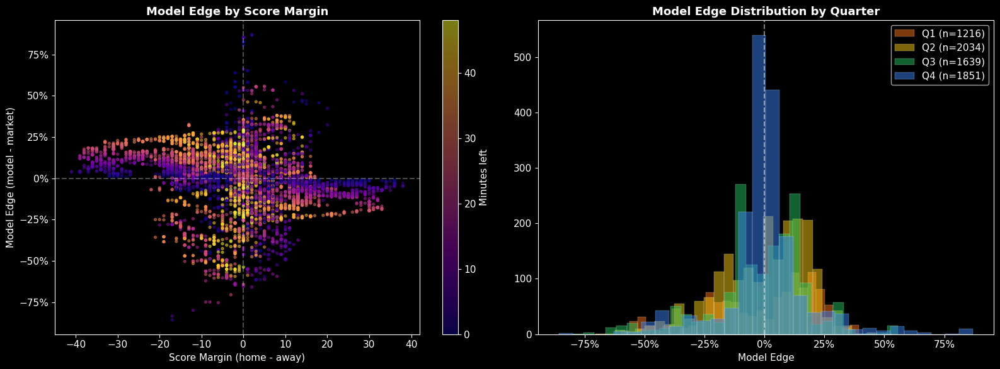
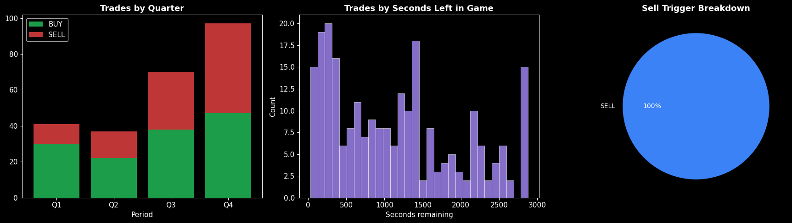
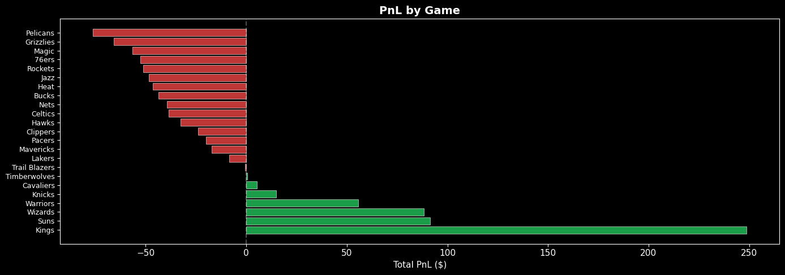
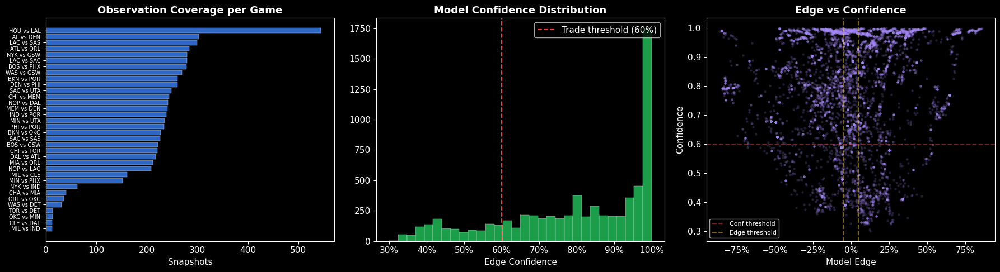
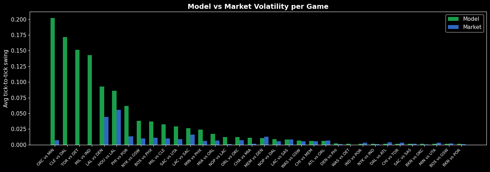

# Courtside Alpha — Data Analysis

Comprehensive analysis of all trading data and live game observations collected by the system.

    Trades loaded: 349
    Live snapshots loaded: 6807
    Games traded: 32
    Games observed: 34
    Wallet balance: $6,932.38

## 1. Trading Performance Overview

    =======================================================
             COURTSIDE ALPHA — PERFORMANCE SUMMARY
    =======================================================
      Total trades:       349
      BUY orders:         204
      SELL orders:        145
      Open positions:     20
      Resolved (w/ PnL):  138
      ─────────────────────────────────────
      Wins:               62
      Losses:             76
      Win rate:           44.9%
      ─────────────────────────────────────
      Total PnL:          $-117.62
      Won PnL:            $+1,237.49
      Lost PnL:           $-1,355.11
      Avg win:            $+19.96
      Avg loss:           $-17.83
      Best trade:         $+221.67
      Worst trade:        $-46.88
      Total staked:       $17,450
      ROI:                -0.67%
    =======================================================

## 2. Cumulative PnL Over Time

    

    

## 3. Edge Analysis — Model vs Market at Trade Time

    

    

## 4. Model Accuracy — Live Predictions vs Actual Outcomes

    Snapshots with known outcomes: 6807

    

    

## 5. Live Game Trajectories — Model vs Market Over Time

    

    

## 6. Model Edge Heatmap — Margin vs Time Remaining

    

    

    
    Model Edge Summary by Quarter:
              mean    std    min    max  count
    quarter                                   
    Q1      -0.017  0.235 -0.600  0.463   1216
    Q2      -0.005  0.188 -0.706  0.531   2034
    Q3      -0.016  0.202 -0.800  0.558   1639
    Q4       0.003  0.180 -0.858  0.870   1851

## 7. Trade Timing — When Does the Bot Trade?

    

    

## 8. Per-Game Breakdown

    PnL by Game (sorted by total PnL)
    ==========================================================================================
    Game                                Trades    W/L  Total PnL      Avg      Best     Worst
    ------------------------------------------------------------------------------------------
    Kings                                   16  9W/7L $  +248.75 $ +15.55 $ +221.67 $  -22.06
    Suns                                     3  3W/0L $   +91.32 $ +30.44 $  +45.83 $  +10.87
    Wizards                                  3  2W/1L $   +88.26 $ +29.42 $ +112.50 $  -33.33
    Warriors                                 2  1W/1L $   +55.74 $ +27.87 $  +71.43 $  -15.69
    Knicks                                  11  6W/5L $   +14.78 $  +1.34 $  +28.79 $  -27.78
    Cavaliers                                1  1W/0L $    +5.26 $  +5.26 $   +5.26 $   +5.26
    Timberwolves                            10  7W/3L $    +0.44 $  +0.04 $   +8.46 $  -32.61
    Trail Blazers                            1  0W/1L $    -0.70 $  -0.70 $   -0.70 $   -0.70
    Lakers                                   1  0W/1L $    -8.33 $  -8.33 $   -8.33 $   -8.33
    Mavericks                                2  1W/1L $   -17.08 $  -8.54 $  +22.92 $  -40.00
    Pacers                                   2  0W/2L $   -20.06 $ -10.03 $   -0.72 $  -19.33
    Clippers                                20 10W/10L $   -23.92 $  -1.20 $  +43.18 $  -42.86
    Hawks                                    1  0W/1L $   -32.61 $ -32.61 $  -32.61 $  -32.61
    Celtics                                 12  5W/7L $   -38.53 $  -3.21 $  +56.25 $  -31.25
    Nets                                     1  0W/1L $   -39.47 $ -39.47 $  -39.47 $  -39.47
    Bucks                                    1  0W/1L $   -43.75 $ -43.75 $  -43.75 $  -43.75
    Heat                                     1  0W/1L $   -46.43 $ -46.43 $  -46.43 $  -46.43
    Jazz                                     2  0W/2L $   -48.49 $ -24.24 $   -6.38 $  -42.11
    Rockets                                 16 5W/11L $   -51.24 $  -3.20 $  +66.00 $  -27.59
    76ers                                   23 11W/12L $   -52.74 $  -2.29 $  +15.52 $  -46.88
    Magic                                    2  0W/2L $   -56.70 $ -28.35 $  -18.60 $  -38.10
    Grizzlies                                2  0W/2L $   -65.91 $ -32.95 $  -25.00 $  -40.91
    Pelicans                                 5  1W/4L $   -76.21 $ -15.24 $  +19.44 $  -46.88
    ------------------------------------------------------------------------------------------
    TOTAL                                  138        $  -117.62

    

    

## 9. Live Observation Coverage & Model Confidence

    

    

    
    Total live observations: 6,807
    Games observed: 34
    Avg snapshots per game: 200
    With Polymarket odds: 6,740 (99%)
    With feature vectors: 6,807 (100%)

## 10. Model Volatility — How Stable Are Predictions Within a Game?

    Model Prediction Volatility (tick-to-tick swing)
    ===============================================================================================
    Game            Snaps  Model Avg  Model Max    Mkt Avg    Mkt Max  Vol Ratio
    -----------------------------------------------------------------------------------------------
    OKC vs MIN         13     0.2018      0.766      0.007      0.090      26.9x
    CLE vs DAL         12     0.1717      0.674      0.000      0.000        N/A
    TOR vs DET         13     0.1515      0.700      0.000      0.000        N/A
    MIL vs IND         12     0.1428      0.456      0.000      0.000        N/A
    LAL vs DEN        303     0.0925      0.905      0.045      0.655       2.1x
    HOU vs LAL        544     0.0861      0.577      0.056      0.544       1.5x
    PHI vs POR        234     0.0619      0.635      0.013      0.290       4.7x
    NYK vs GSW        280     0.0384      0.648      0.010      0.140       3.8x
    BOS vs PHX        278     0.0371      0.442      0.011      0.435       3.4x
    MIL vs CLE        161     0.0323      0.215      0.010      0.160       3.3x
    SAC vs UTA        248     0.0289      0.684      0.009      0.151       3.3x
    LAC vs SAC        280     0.0263      0.495      0.016      0.500       1.6x
    MIN vs PHX        152     0.0242      0.314      0.006      0.140       4.1x
    MIA vs ORL        212     0.0175      0.538      0.007      0.080       2.7x
    NOP vs LAC        209     0.0123      0.221      0.001      0.075       9.7x
    ORL vs OKC         36     0.0123      0.098      0.007      0.110       1.7x
    CHA vs MIA         40     0.0112      0.099      0.002      0.037       6.6x
    MEM vs DEN        241     0.0107      0.295      0.013      0.330       0.8x
    NOP vs DAL        242     0.0088      0.156      0.006      0.090       1.6x
    LAC vs SAS        299     0.0082      0.219      0.009      0.115       1.0x
    WAS vs GSW        269     0.0064      0.116      0.005      0.110       1.2x
    CHI vs MEM        244     0.0063      0.124      0.005      0.150       1.2x
    ATL vs ORL        284     0.0060      0.179      0.007      0.120       0.9x
    DEN vs PHI        261     0.0020      0.052      0.001      0.030       2.3x
    WAS vs DET         31     0.0018      0.006      0.000      0.000        N/A
    IND vs POR        238     0.0018      0.034      0.003      0.138       0.6x
    NYK vs IND         62     0.0017      0.004      0.001      0.015       1.7x
    DAL vs ATL        217     0.0015      0.006      0.004      0.080       0.4x
    CHI vs TOR        221     0.0015      0.006      0.003      0.095       0.5x
    SAC vs SAS        226     0.0015      0.006      0.002      0.050       0.8x
    BKN vs OKC        227     0.0015      0.006      0.001      0.012       2.9x
    MIN vs UTA        235     0.0014      0.006      0.004      0.060       0.4x
    BOS vs GSW        222     0.0013      0.007      0.002      0.040       0.6x
    BKN vs POR        261     0.0013      0.017      0.001      0.050       1.2x

    

    

    
    Average volatility ratio (model/market): 3.1x
    (Lower is better — 1.0x means model is as stable as the market)

