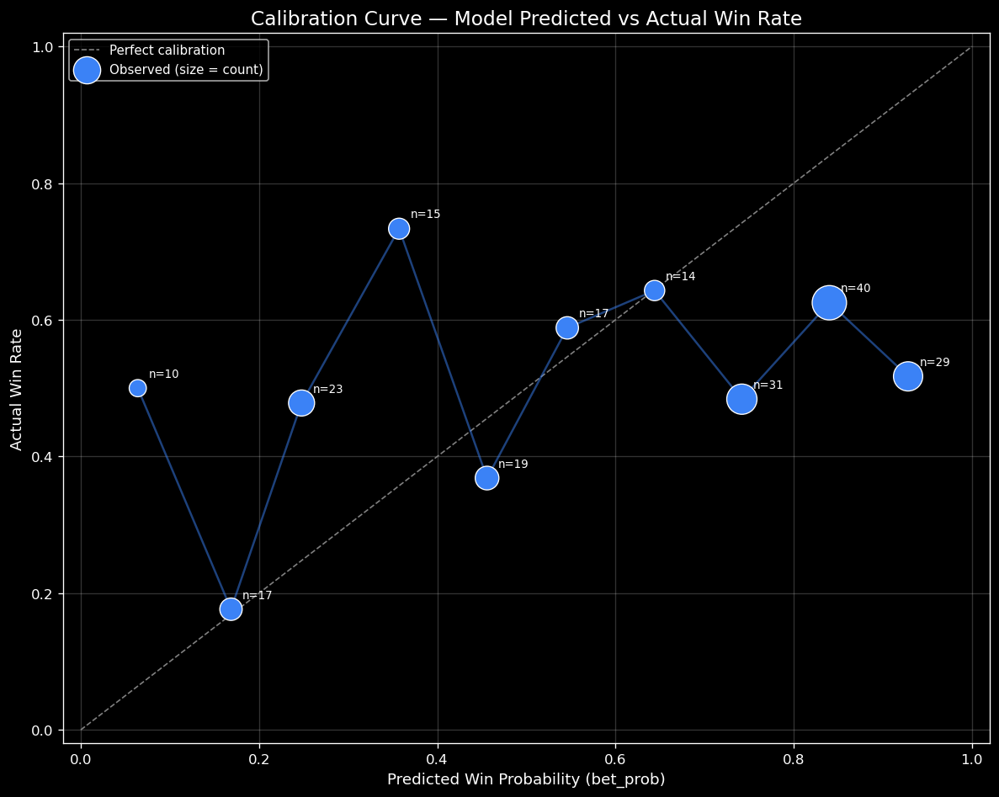
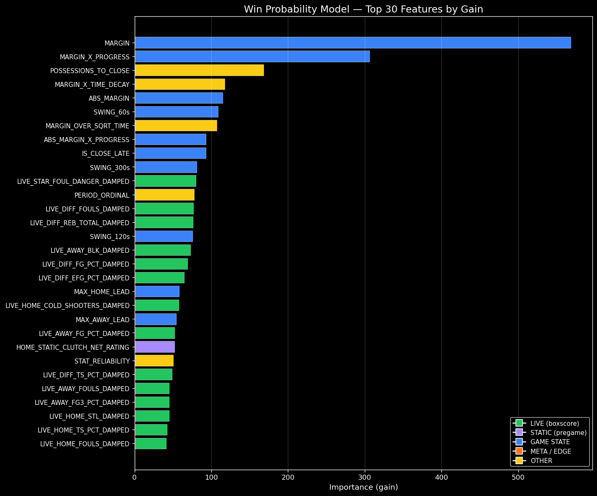
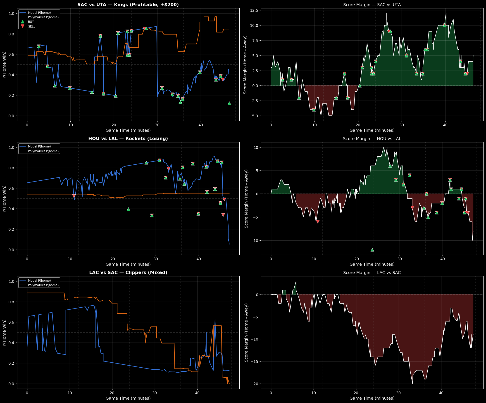
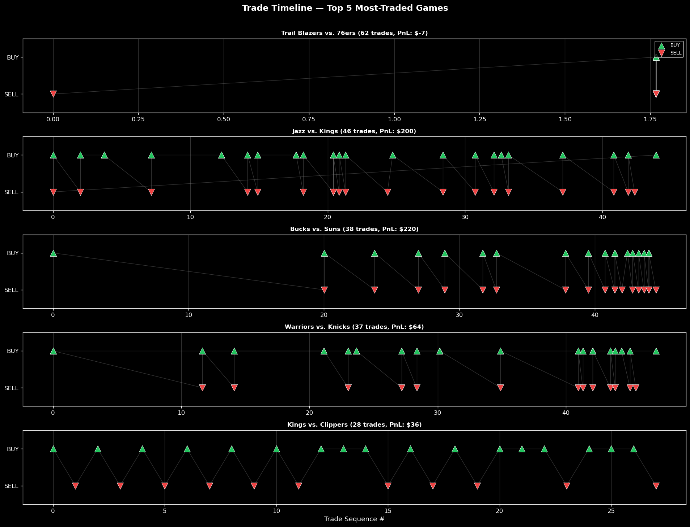
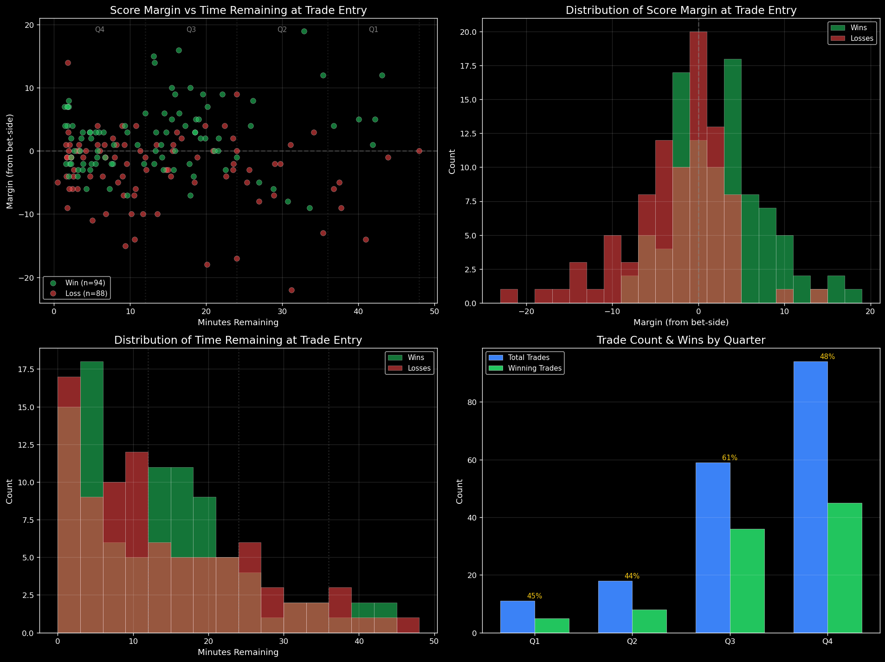
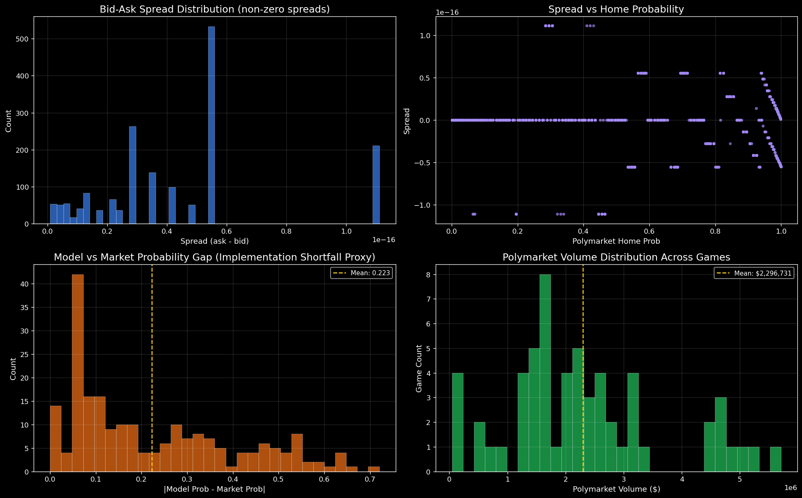
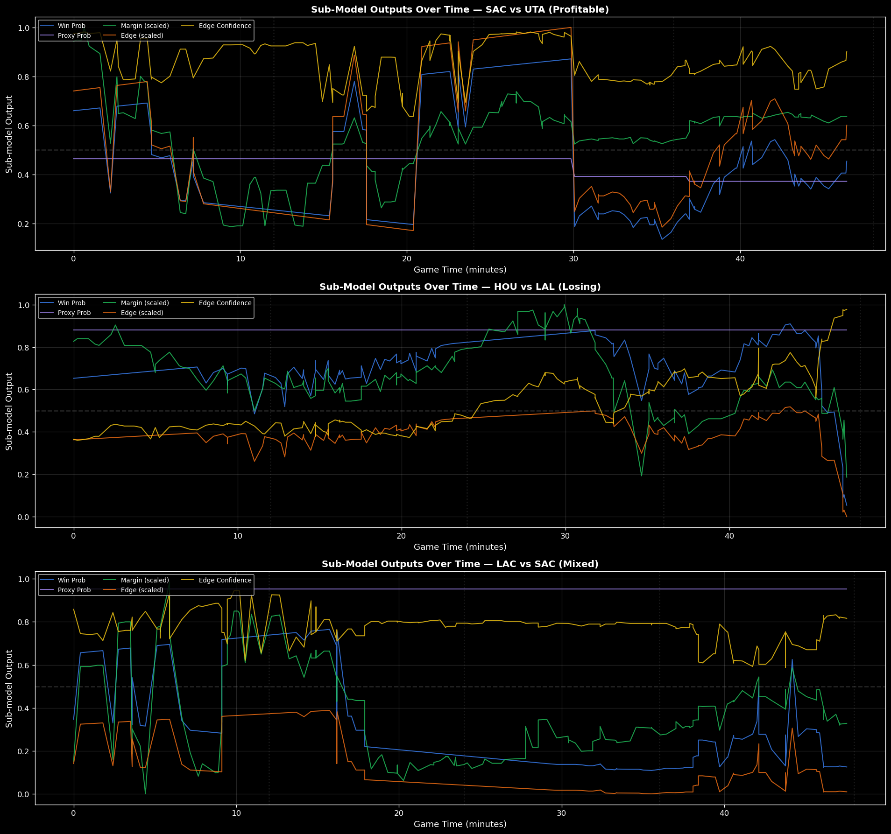
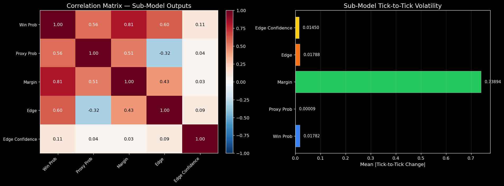

# Deep Analysis: Trading Bot Performance & Model Diagnostics

Comprehensive analysis of 138 resolved trades, XGBoost model internals, live game snapshots, and sub-model decomposition.

    Requirement already satisfied: xgboost in /opt/anaconda3/lib/python3.12/site-packages (3.2.0)
    Requirement already satisfied: numpy in /opt/anaconda3/lib/python3.12/site-packages (from xgboost) (2.2.6)
    Requirement already satisfied: scipy in /opt/anaconda3/lib/python3.12/site-packages (from xgboost) (1.15.1)
    Note: you may need to restart the kernel to use updated packages.
    Imports OK

    Total trades in DB:     511
    Resolved trades:        215
    Live snapshots:         12081
    Unique games (trades):  34
    Unique games (snaps):   59
    Live features:          255
    Pregame features:       160
    Edge features:          259

---
## Section 1: Resolved Trade Log & Calibration Curve

Display all 138 resolved trades and build a calibration curve to assess how well the model's predicted probabilities match actual win rates.

    ================================================================================
      RESOLVED TRADE LOG  —  215 trades
    ================================================================================
      Total PnL:    $277.17
      Win rate:     51.6%
      Avg PnL/trade: $1.29
      Max win:      $221.67
      Max loss:     $-46.88
    ================================================================================
    

<table border="1" class="dataframe">
  <thead>
    <tr style="text-align: right;">
      <th></th>
      <th>timestamp</th>
      <th>game_id</th>
      <th>target_team</th>
      <th>action</th>
      <th>model_implied_prob</th>
      <th>market_implied_prob</th>
      <th>bought_home</th>
      <th>home_score</th>
      <th>away_score</th>
      <th>period</th>
      <th>secs_left</th>
      <th>pnl</th>
      <th>won</th>
    </tr>
  </thead>
  <tbody>
    <tr>
      <th>9</th>
      <td>2026-03-15 04:05:30</td>
      <td>0x671b141d...</td>
      <td>Clippers</td>
      <td>SELL(TRAILING_STOP(peak 0.540 now 0.490))</td>
      <td>0.1644</td>
      <td>0.49</td>
      <td>0</td>
      <td>NaN</td>
      <td>NaN</td>
      <td>NaN</td>
      <td>NaN</td>
      <td>24.24</td>
      <td>1</td>
    </tr>
    <tr>
      <th>11</th>
      <td>2026-03-15 04:20:57</td>
      <td>0x671b141d...</td>
      <td>Clippers</td>
      <td>SELL(TRAILING_STOP(peak 0.730 now 0.670))</td>
      <td>0.1305</td>
      <td>0.67</td>
      <td>0</td>
      <td>NaN</td>
      <td>NaN</td>
      <td>NaN</td>
      <td>NaN</td>
      <td>18.37</td>
      <td>1</td>
    </tr>
    <tr>
      <th>14</th>
      <td>2026-03-15 04:36:18</td>
      <td>0x671b141d...</td>
      <td>Clippers</td>
      <td>SELL(EDGE_FLIP(was -0.192 now +0.060))</td>
      <td>0.1698</td>
      <td>0.89</td>
      <td>0</td>
      <td>NaN</td>
      <td>NaN</td>
      <td>NaN</td>
      <td>NaN</td>
      <td>16.42</td>
      <td>1</td>
    </tr>
    <tr>
      <th>16</th>
      <td>2026-03-15 04:38:12</td>
      <td>0x671b141d...</td>
      <td>Clippers</td>
      <td>SELL(TRAILING_STOP(peak 0.240 now 0.180))</td>
      <td>0.2503</td>
      <td>0.18</td>
      <td>1</td>
      <td>NaN</td>
      <td>NaN</td>
      <td>NaN</td>
      <td>NaN</td>
      <td>31.82</td>
      <td>1</td>
    </tr>
    <tr>
      <th>18</th>
      <td>2026-03-15 04:41:19</td>
      <td>0x671b141d...</td>
      <td>Clippers</td>
      <td>SELL(EDGE_FLIP(was +0.070 now -0.050))</td>
      <td>0.1698</td>
      <td>0.22</td>
      <td>1</td>
      <td>NaN</td>
      <td>NaN</td>
      <td>NaN</td>
      <td>NaN</td>
      <td>11.11</td>
      <td>1</td>
    </tr>
    <tr>
      <th>...</th>
      <td>...</td>
      <td>...</td>
      <td>...</td>
      <td>...</td>
      <td>...</td>
      <td>...</td>
      <td>...</td>
      <td>...</td>
      <td>...</td>
      <td>...</td>
      <td>...</td>
      <td>...</td>
      <td>...</td>
    </tr>
    <tr>
      <th>502</th>
      <td>2026-03-22 04:16:01</td>
      <td>0x21a3b5f6...</td>
      <td>Suns</td>
      <td>SELL(STOP_LOSS(entry 0.430 now 0.260))</td>
      <td>0.6082</td>
      <td>0.26</td>
      <td>1</td>
      <td>97.0</td>
      <td>100.0</td>
      <td>4.0</td>
      <td>154.0</td>
      <td>-19.77</td>
      <td>0</td>
    </tr>
    <tr>
      <th>504</th>
      <td>2026-03-22 04:16:46</td>
      <td>0x21a3b5f6...</td>
      <td>Suns</td>
      <td>SELL(EDGE_FLIP(was +0.348 now -0.051))</td>
      <td>0.4587</td>
      <td>0.51</td>
      <td>1</td>
      <td>100.0</td>
      <td>102.0</td>
      <td>4.0</td>
      <td>133.0</td>
      <td>48.08</td>
      <td>1</td>
    </tr>
    <tr>
      <th>506</th>
      <td>2026-03-22 04:17:52</td>
      <td>0x21a3b5f6...</td>
      <td>Suns</td>
      <td>SELL(EDGE_FLIP(was -0.061 now +0.053))</td>
      <td>0.4731</td>
      <td>0.42</td>
      <td>0</td>
      <td>100.0</td>
      <td>102.0</td>
      <td>4.0</td>
      <td>133.0</td>
      <td>10.42</td>
      <td>1</td>
    </tr>
    <tr>
      <th>508</th>
      <td>2026-03-22 04:18:54</td>
      <td>0x21a3b5f6...</td>
      <td>Suns</td>
      <td>SELL(TRAILING_STOP(peak 0.570 now 0.490))</td>
      <td>0.5544</td>
      <td>0.49</td>
      <td>1</td>
      <td>101.0</td>
      <td>102.0</td>
      <td>4.0</td>
      <td>133.0</td>
      <td>8.33</td>
      <td>1</td>
    </tr>
    <tr>
      <th>510</th>
      <td>2026-03-22 04:19:08</td>
      <td>0x21a3b5f6...</td>
      <td>Suns</td>
      <td>SELL(TIME_DECAY(101s left))</td>
      <td>0.4375</td>
      <td>0.42</td>
      <td>1</td>
      <td>101.0</td>
      <td>102.0</td>
      <td>4.0</td>
      <td>101.0</td>
      <td>-7.14</td>
      <td>0</td>
    </tr>
  </tbody>
</table>

215 rows × 13 columns

    

    

    
      CALIBRATION TABLE
      ============================================================
      Bin                     Count  Pred Mean  Actual WR
      ------------------------------------------------------------
      (0.0124, 0.11]             10     0.0639     0.5000
      (0.11, 0.207]              17     0.1686     0.1765
      (0.207, 0.303]             23     0.2477     0.4783
      (0.303, 0.4]               15     0.3572     0.7333
      (0.4, 0.497]               19     0.4559     0.3684
      (0.497, 0.594]             17     0.5459     0.5882
      (0.594, 0.69]              14     0.6439     0.6429
      (0.69, 0.787]              31     0.7418     0.4839
      (0.787, 0.884]             40     0.8400     0.6250
      (0.884, 0.98]              29     0.9284     0.5172
      ============================================================

---
## Section 2: XGBoost Feature Importances

Load all 4 XGBoost sub-models (win_probability, margin, market_proxy, edge_model), extract feature importance by gain, and compare which features drive each model.

      win_probability     : 246 features with importance, top = MARGIN (568.4)
      margin              : 252 features with importance, top = MARGIN_X_PROGRESS (37582.5)
      market_proxy        : 154 features with importance, top = DIFF_STATIC_NET_RATING_FADED (996.0)
      edge_model          : 244 features with importance, top = ABS_MARGIN_OVER_SQRT_TIME (242.2)
    
    All models loaded successfully.

    

    

      TOP FEATURES ACROSS ALL 4 MODELS (sorted by win_probability importance)
      ==============================================================================================================
      Feature                             Category              WinProb     Margin   MktProxy       Edge
      --------------------------------------------------------------------------------------------------------------
      MARGIN                              GAME STATE              568.4    30641.3        0.0       40.2
      MARGIN_X_PROGRESS                   GAME STATE              306.2    37582.5        0.0       21.1
      POSSESSIONS_TO_CLOSE                OTHER                   168.2    32091.1        0.0       63.8
      MARGIN_X_TIME_DECAY                 OTHER                   117.2    14901.5        0.0       21.5
      ABS_MARGIN                          GAME STATE              114.8     5459.0        0.0       37.1
      SWING_60s                           GAME STATE              108.7     2891.0        0.0       24.8
      MARGIN_OVER_SQRT_TIME               OTHER                   107.2    15463.0        0.0       21.5
      ABS_MARGIN_X_PROGRESS               GAME STATE               92.9     6756.8        0.0       69.1
      IS_CLOSE_LATE                       GAME STATE               92.7     3002.7        0.0        0.0
      SWING_300s                          GAME STATE               80.7     2476.8        0.0       18.7
      LIVE_STAR_FOUL_DANGER_DAMPED        LIVE (boxscore)          79.7      202.5        0.0       19.9
      PERIOD_ORDINAL                      OTHER                    77.4      433.6        0.0       32.2
      LIVE_DIFF_FOULS_DAMPED              LIVE (boxscore)          76.8      130.3        0.0       17.8
      LIVE_DIFF_REB_TOTAL_DAMPED          LIVE (boxscore)          76.1      264.4        0.0       14.4
      SWING_120s                          GAME STATE               75.2     1743.4        0.0       24.2
      LIVE_DIFF_FG_PCT_DAMPED             LIVE (boxscore)          69.0     1734.6        0.0       12.3
      MAX_HOME_LEAD                       GAME STATE               58.0    18601.7        0.0       20.5
      MAX_AWAY_LEAD                       GAME STATE               54.0    12241.9        0.0       20.3
      HOME_STATIC_CLUTCH_NET_RATING       STATIC (pregame)         51.7      290.5      162.4       35.6
      LEAD_CHANGES                        GAME STATE               40.4      348.0        0.0       85.6
      ==============================================================================================================
    
      FEATURE CATEGORY BREAKDOWN (win_probability model, all features):
                      count   total_gain   avg_gain
    category                                       
    GAME STATE           32  2019.045778  63.095181
    STATIC (pregame)    157  1713.107719  10.911514
    LIVE (boxscore)      48  1516.226969  31.588062
    OTHER                 9   596.958032  66.328670

---
## Section 3: Live Snapshot Time Series for 3 Games

Visualize model vs market probability and score margin over game time for three selected games:
- **SAC vs UTA (Kings game)** — Profitable (+$200 PnL)
- **HOU vs LAL (Rockets game)** — Losing
- **LAC vs SAC (Clippers game)** — Mixed

Trade entry/exit points are overlaid from the trades database.

    

    

      SAC vs UTA — Kings (Profitable, +$200)
        Trades: 46 total, 18 resolved, PnL: $200.26
    
      HOU vs LAL — Rockets (Losing)
        Trades: 34 total, 17 resolved, PnL: $-59.57
    
      LAC vs SAC — Clippers (Mixed)
        Trades: 28 total, 11 resolved, PnL: $36.30
    

---
## Section 4: Buy/Sell Sequencing & Round-Trip Analysis

Analyze trading patterns per game: buy/sell counts, round-trip sequences (buy-sell-buy cycles), and whether more frequent trading correlates with better or worse PnL.

      BUY/SELL SEQUENCING SUMMARY
      ================================================================================
      Total unique games traded:  45
      Avg trades per game:        11.4
      Games with >5 trades:       20
      Games with >10 trades:      18
      Total round-trips:          204
      Games with round-trips:     32
    
      Correlation (trade count vs PnL): +0.530
      Correlation (round-trips vs PnL): +0.527
    
      Game                                      Trades  Buys  Sells  RTs        PnL
      --------------------------------------------------------------------------------
      0x40e9eade... Trail Blazers vs. 76ers         62    35     27   26 $    -6.57
      0x81672be3... Jazz vs. Kings                  46    27     19   18 $   200.26
      0x21a3b5f6... Bucks vs. Suns                  38    19     19   18 $   219.55
      0xc4eea371... Warriors vs. Knicks             37    24     13   12 $    63.84
      0x671b141d... Kings vs. Clippers              28    17     11   10 $    36.30
      0xe5b34d47... Suns vs. Celtics                28    14     14   13 $     6.95
      0xeee40ed2... Suns vs. Timberwolves           25    13     12   12 $    46.27
      0xa50445f5... Heat vs. Rockets                22    11     11   10 $   -38.73
      0xde957071... Lakers vs. Rockets              22    11     11   10 $     3.87
      0xee71d338... Clippers vs. Mavericks          18     9      9    8 $    84.26
      0x758ed7ee... Raptors vs. Nuggets             17     9      8    8 $     4.53
      0x2446a50e... 76ers vs. Jazz                  16     8      8    7 $     9.69
      0xca0136d7... Trail Blazers vs. Timberwolves      16     8      8    7 $    12.22
      0x54fde4b1... Spurs vs. Clippers              14     8      6    5 $   -24.58
      0xe9e80920... 76ers vs. Kings                 13     7      6    6 $    40.68
      ================================================================================

    

    

    
      ROUND-TRIP vs PnL ANALYSIS
      ==================================================
      Games WITH round-trips:   32, avg PnL: $    9.76
      Games WITHOUT round-trips:  13, avg PnL: $   -2.69
      ==================================================

---
## Section 5: Score Differential & Time Remaining at Trade

Analyze when trades fire relative to the game clock and score state. Do winning trades tend to happen at different margins or time points than losing trades?

      Trades with score data: 182
      Wins: 94, Losses: 88
    
      MARGIN AT ENTRY (from bet-side perspective)
      --------------------------------------------------
      Wins  — avg margin: +2.1, median: +2.0
      Losses — avg margin: -3.0, median: -2.0
    
      TIME REMAINING AT ENTRY
      --------------------------------------------------
      Wins  — avg mins left: 13.7, median: 13.2
      Losses — avg mins left: 14.3, median: 10.7
    
      TRADES BY QUARTER
      ------------------------------------------------------------
        Q   Count       %   Wins    Win%        PnL
      Q 1      11    6.0%      5   45.5% $   -33.18
      Q 2      18    9.9%      8   44.4% $   151.87
      Q 3      59   32.4%     36   61.0% $   152.27
      Q 4      94   51.6%     45   47.9% $   -15.20
      ------------------------------------------------------------

    

    

---
## Section 6: Bid-Ask Spread Analysis

Examine Polymarket bid-ask spreads from snapshot data and volume distribution as a proxy for liquidity conditions the bot traded in.

      Snapshots with bid data: 10748 / 12081
      Snapshots with ask data: 10748 / 12081
    
      BID-ASK SPREAD STATISTICS
      ==================================================
      Snapshots with spread data: 10748
      Mean spread:                -0.0000
      Median spread:              0.0000
      Std spread:                 0.0000
      Max spread:                 0.0000
      Mean spread (% of mid):     -0.00%
    
      NOTE: 6225/10748 snapshots have bid == ask (locked/no real spread)
      This suggests bid-ask data may not reflect true order book spreads.
      Estimating implementation shortfall from model vs market gap instead.
    
      MODEL vs MARKET GAP (Implementation Shortfall Proxy)
      ==================================================
      Mean |model - market|: 0.2226
      Median:                0.1562
      Max:                   0.7202
    
      POLYMARKET VOLUME (max per game)
      ==================================================
      Games with volume data: 59
      Mean volume:   $2,296,731
      Median volume: $2,102,512
      Max volume:    $5,705,815
      Min volume:    $45,708

    

    

---
## Section 7: Sub-Model Output Decomposition

Analyze the relationship and volatility of the 5 sub-model outputs (model_win_prob, model_proxy_prob, model_margin, model_edge, model_edge_confidence) across games and over time.

    

    

      TICK-TO-TICK VOLATILITY (absolute change per snapshot)
      ===========================================================================
      Sub-Model              Mean |dTick|          Std          Max    N ticks
      ---------------------------------------------------------------------------
      Win Prob                   0.017818     0.062124     0.937600      12022
      Proxy Prob                 0.000091     0.001849     0.072200      12022
      Margin                     0.738937     1.867943    54.400000      12022
      Edge                       0.017881     0.062062     0.937500      12022
      Edge Confidence            0.014496     0.033946     0.485700      12022
      ===========================================================================
    
      Most volatile sub-model: Margin (avg tick-to-tick swing: 0.738937)
    

    

    

    
      CORRELATION MATRIX
      ================================================================================
                           model_win_prob  model_proxy_prob  model_margin  model_edge  model_edge_confidence
    model_win_prob                  1.000             0.561         0.807       0.602                  0.113
    model_proxy_prob                0.561             1.000         0.508      -0.324                  0.036
    model_margin                    0.807             0.508         1.000       0.432                  0.030
    model_edge                      0.602            -0.324         0.432       1.000                  0.094
    model_edge_confidence           0.113             0.036         0.030       0.094                  1.000
      ================================================================================

